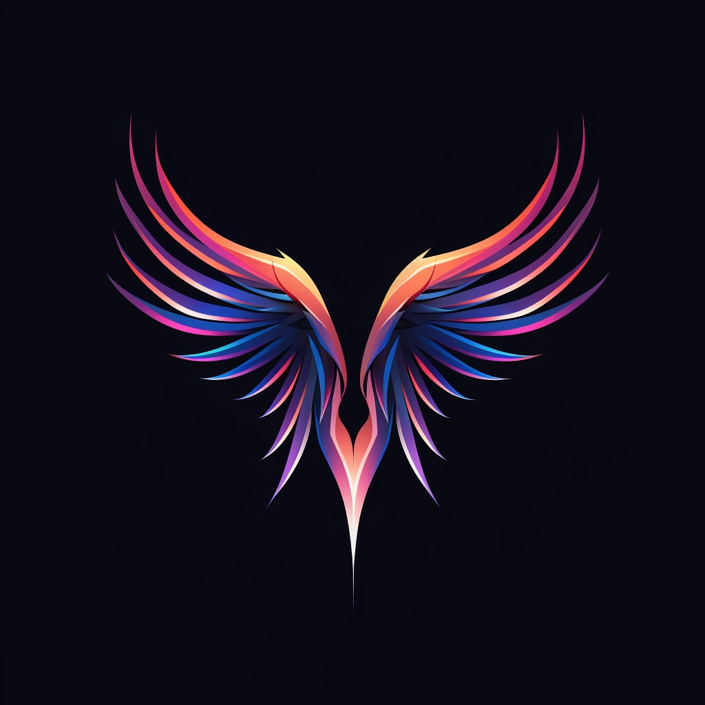

<!-- prettier-ignore-start -->
<!-- markdownlint-disable -->

  

<h1 align="center">⚡ Unruggable Memecoin ⚡</h1>

  <strong>☣️ A framework for building safer memecoins 💸</strong>
  <a>https://unruggable.meme</a>

# Unruggable Memecoin

Tired of getting rugpulled? Introducing Unruggable Memecoin, a project designed with security and transparency at its core. Our innovative contracts and safeguards ensure a fair and secure experience for all users.

> ⚠️⚠️⚠️
>
> While we have made every effort to ensure the security and integrity of the Unruggable Memecoin contracts, it's important to note that they have not yet undergone security audits. As with any smart contract, there remains a possibility of undiscovered vulnerabilities. Our approach is more secure than tokens launched without locked Liquidity Pool (LP) tokens or without safeguards on token supply allocation, but this does not imply that the contracts are bug-free or that investments in tokens launched using Unruggable Memecoin framework are risk-free. Investors and users should exercise due diligence and caution. This is not financial advice. Do your own research. And remember, don't invest more than you can afford to lose. Stay safe!
>
> ⚠️⚠️⚠️

## Project structure

### Contracts

The contracts are located in the `contracts/` directory. It's a `scarb` project, so you can use the `scarb` CLI to build it.

It uses `Starknet Foundry` for tests.

### Frontend

> TODO

## 📖 License

This project is licensed under the **MIT license**. See [LICENSE](LICENSE) for more information.

## Contributors ✨

Thanks goes to these wonderful people ([emoji key](https://allcontributors.org/docs/en/emoji-key)):

<!-- ALL-CONTRIBUTORS-LIST:START - Do not remove or modify this section -->
<!-- prettier-ignore-start -->
<!-- markdownlint-disable -->
<table>
  <tbody>
    <tr>
      <td align="center" valign="top" width="14.28%"><a href="https://github.com/abdelhamidbakhta"> <b>Abdel @ StarkWare </b></a> <a href="https://github.com/keep-starknet-strange/unruggable-memecoin/commits?author=abdelhamidbakhta" title="Code">💻</a></td>
      <td align="center" valign="top" width="14.28%"><a href="https://rules.art/"> <b>Charles Lanier</b></a> <a href="https://github.com/keep-starknet-strange/unruggable-memecoin/commits?author=0xChqrles" title="Code">💻</a></td>
    </tr>
  </tbody>
</table>

<!-- markdownlint-restore -->
<!-- prettier-ignore-end -->

<!-- ALL-CONTRIBUTORS-LIST:END -->

This project follows the [all-contributors](https://github.com/all-contributors/all-contributors) specification. Contributions of any kind welcome!