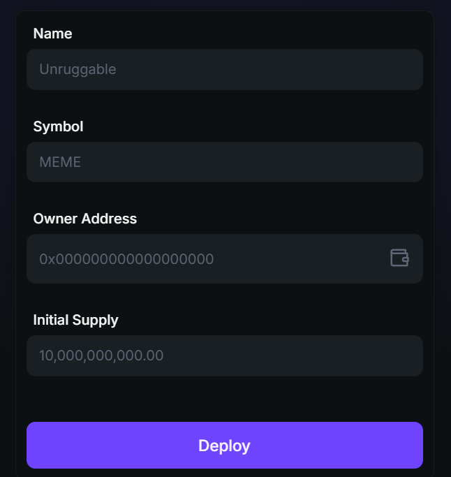
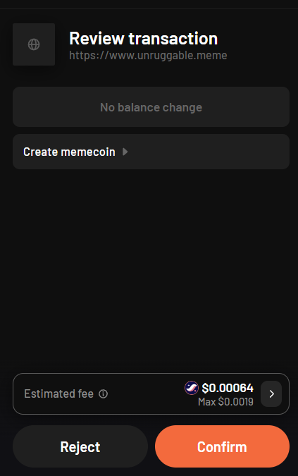
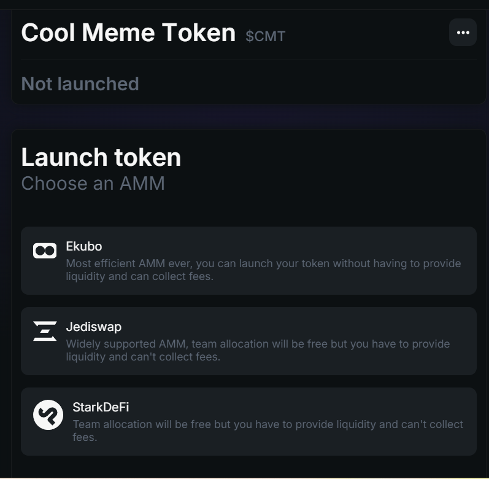
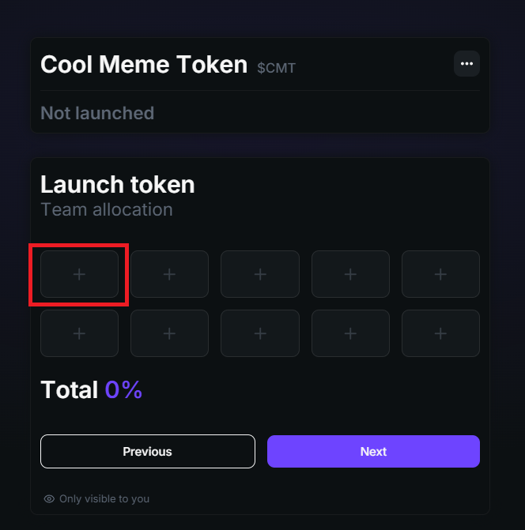
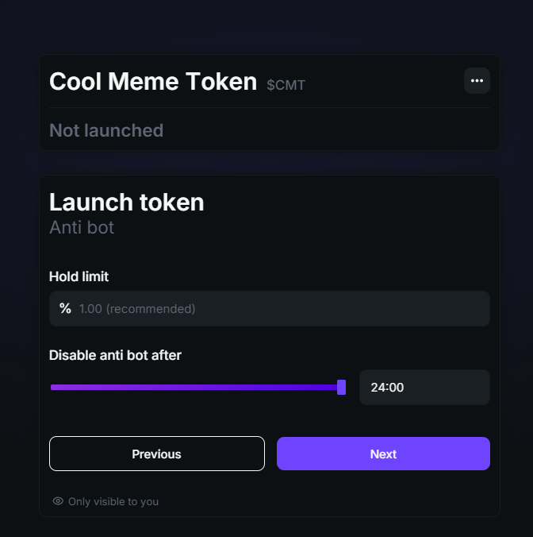
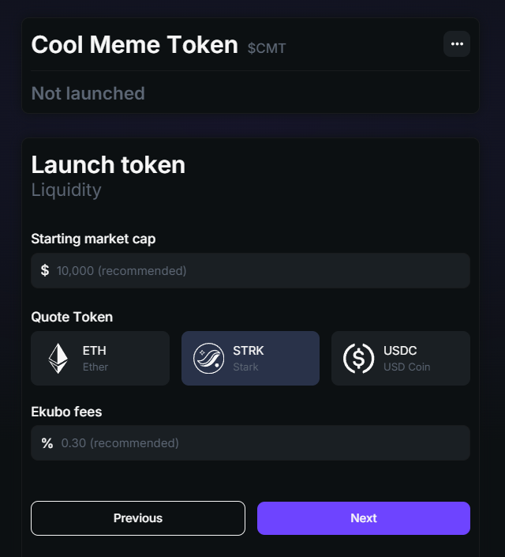
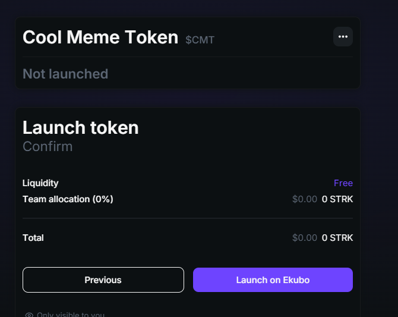
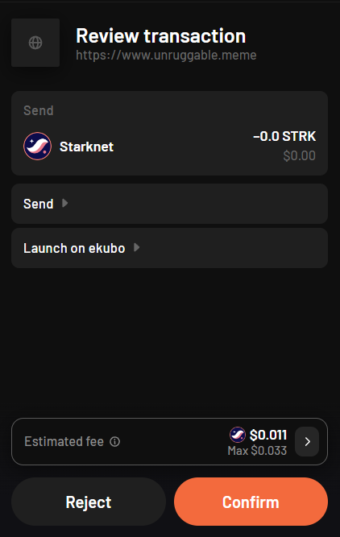

# How to use Unruggable App

Using unruggable is quite easy. you can either:
- `deploy` your favorite meme coin from its launch pad
- `check` if a token is unraggable or not.

## How to deploy a memecoin using unruggable?

### connect your wallet
first thing first, you need to head to unruggable portal and connect your starknet wallet. this is the most technical step:)

  

### deploy your memecoin
It's time to navigate to the deploy page. to do that,  Simply click on the "Deploy" button:

  

then there is a form that should filled with proper values:

here is what you need to know about this form:
- `Name`: the name of your memecoin like `Cool Meme Token`
- `Symbol`: the symbol of your memecoin like `CMT`
- `Owner Address`: probably it's best to put `your starknet wallet address` there. (by clicking the wallet logo, it will fill with your connected wallet address.) 
- `Initial Supply`: the supply of your memecoin like `21,000,000`

click on the deploy button and it will pop up a contract call from your wallet to create the specific memecoin:

  

### list on AMMs
Congratulations! You have successfully created your memecoin on starknet. Now it's up to you to decide which liquidity provider on starknet to use for your token.

currently, options are among: 
- **Ekubo**: Most efficient AMM ever, you can launch your token without having to provide liquidity and can collect fees.
- **Jediswap**: Widely supported AMM, team allocation will be free but you have to provide liquidity and can't collect fees.
- **StarkDeFi**: Team allocation will be free but you have to provide liquidity and can't collect fees.

### team allocation
After selecting the liquidity pool, you will be directed to the team allocation page.(For this documentation, we will use **Ekubo**.)

 
On this page, you can allocate some of your tokens to your team, friends, and Vitalik!

### Anti bot
next step is to set anti bot (hold limit). you know that bots are everywhere and if they spot a new pool in one of the AMMs, they probably buy a big portion of that token before users notice that. so it's totally up to you to use this feature.

> e.g. %1 for 24:00 means no single wallet can buy more than 1% of the token for 24 hours after launch from the AMM. After that time, this limit vanishes.

### Market cap, token pair and fee
The next step involves setting the token pair and market cap, as well as determining the fee.

you have to set

- `Starting market cap` which is at your disposal
 and 
- `qoute token` which is the pair against your memecoin token. you can choose a stable one like: USDC or starknet native token STRK or the popular ETH.
- `fee` which is again totally up to you.

### launch time
finally, it's launch time!

review the details and Hit the launch button to launch your memecoin on AMM. (this will required a transaction from your wallet.)

that's it.

  

**Question**

I created a memecoin using a tutorial. How can I find my memecoin contract address?

> You can find your meme token info in the "My Tokens" section. More details are available on this page.
